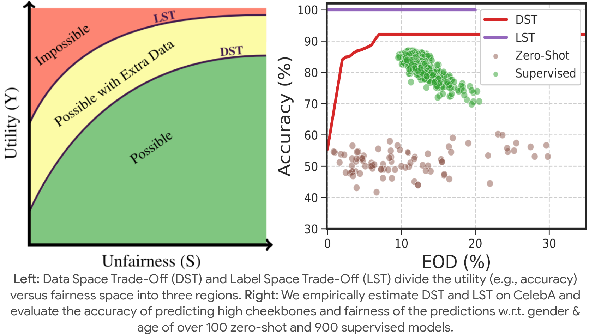

<h1 align="center"><a href="https://sepehrdehdashtian.github.io/Papers/U-FaTE/index.html">Utility-Fairness Trade-Offs and How to Find Them</a></h1>

  
  
  <!--  -->
  
  

  

Welcome to the official repository for the paper, <a href="https://sepehrdehdashtian.github.io/Papers/U-FaTE/index.html">Utility-Fairness Trade-Offs and How to Find Them</a>, published in IEEE/CVF Conference on Computer Vision and Pattern Recognition 2024 (CVPR'24).

Authors: [Sepehr Dehdashtian](https://sepehrdehdashtian.github.io/), [Bashir Sadeghi](https://hal.cse.msu.edu/team/bashir-sadeghi/) and [Vishnu Naresh Boddeti](https://vishnu.boddeti.net/)

## Abstract

  When building classification systems with demographic fairness considerations, there are two objectives to satisfy: 
  <ol>
    <li>  Maximizing utility  for the specific target task  </li>
    <li>  Ensuring fairness  w.r.t. a known demographic attribute. </li>
  </ol>
  These objectives often compete, so optimizing both can lead to a trade-off between utility and fairness. 
  While existing works acknowledge the trade-offs and study their limits, two questions remain unanswered: 
  <ol>
    <li> What are the optimal trade-offs between utility and fairness? </li>
    <li> How can we numerically quantify these trade-offs from data for a desired prediction task and demographic attribute of interest? </li>
  </ol>
  This paper addresses these questions. We introduce two utility-fairness trade-offs: the <b>Data-Space</b> and <b>Label-Space</b> Trade-off. 
  The trade-offs reveal three regions within the utility-fairness plane, delineating what is fully and partially possible and impossible. 
  We propose <b>U-FaTE</b>, a method to numerically quantify the trade-offs for a given prediction task and group fairness definition from data samples. Based on the trade-offs, we introduce a new scheme for evaluating representations. An extensive evaluation of fair representation learning methods and representations from over 1000 pre-trained models revealed that most current approaches are far from the estimated and achievable fairness-utility trade-offs across multiple datasets and prediction tasks 

